# Data Overview - Key Learnings

This file consolidates the main conclusions from the 001-005 data overview notebooks and links directly to the generated diagrams.

## Key Takeaways

1. Temperature-derived features are the strongest short-horizon demand regressors.
2. Storage surplus/deficit (vs seasonal norm) is more informative than raw storage level.
3. WTI matters as a lagged supply proxy (associated gas), not as a same-period demand driver.
4. Henry Hub is regime-based and fat-tailed, so model errors will spike in shock periods.
5. Consumption has a US-specific two-season pattern (winter heating + summer cooling), so models should preserve seasonality.

## 001 - Henry Hub Price (Target Behavior)

### Key learning
- Henry Hub is right-skewed with episodic shock spikes (weather shocks, supply outages, LNG/global events).
- Price regimes are structural (pre-shale, shale, LNG-linked), so stability assumptions can break.
- Model implication: include regime awareness and robust error expectations in volatile periods.

### Diagrams
- Full history:

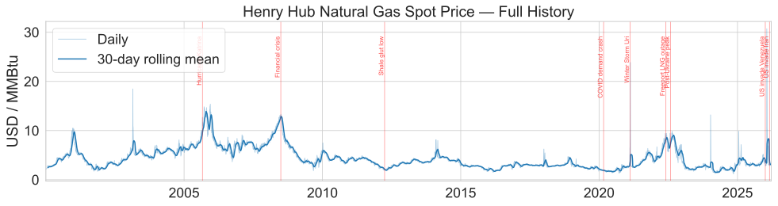

- Distribution:

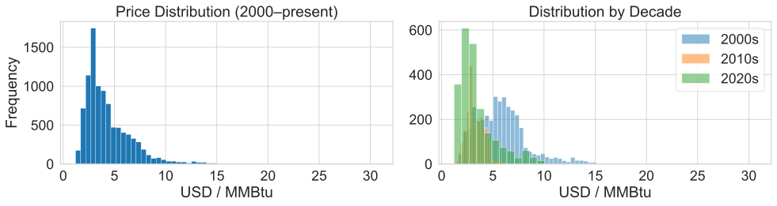

- Volatility regimes:

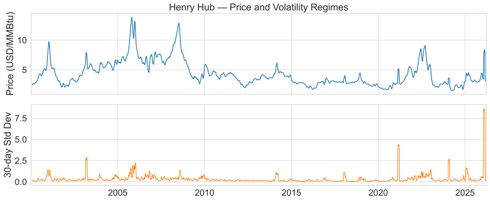

## 002 - WTI Crude (Supply Proxy)

### Key learning
- WTI should be treated as a leading indicator for gas supply via associated gas, not a direct demand regressor.
- Best use in model: lagged WTI terms (roughly 3-6 months) to capture drilling-to-production transmission.

### Diagrams
- Full history:

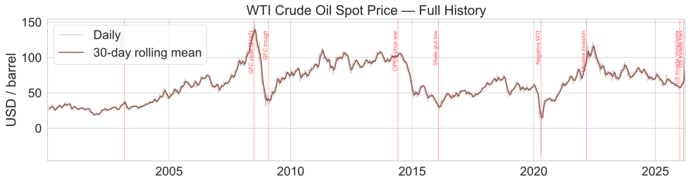

- Distribution:

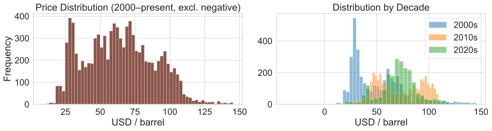

- Volatility regimes:

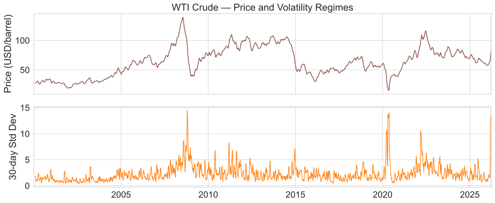

## 003 - EIA Storage (Balance Signal)

### Key learning
- Storage follows a clean injection/withdrawal seasonal cycle.
- The market-relevant variable is storage surplus/deficit versus the 5-year seasonal norm.
- Model implication: prefer normalized storage features (surplus/deficit) over absolute level alone.

### Diagrams
- Full history:

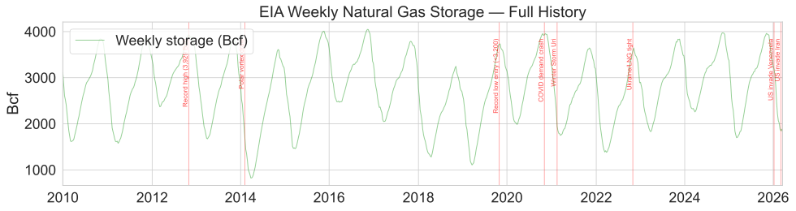

- Injection/withdrawal cycle:

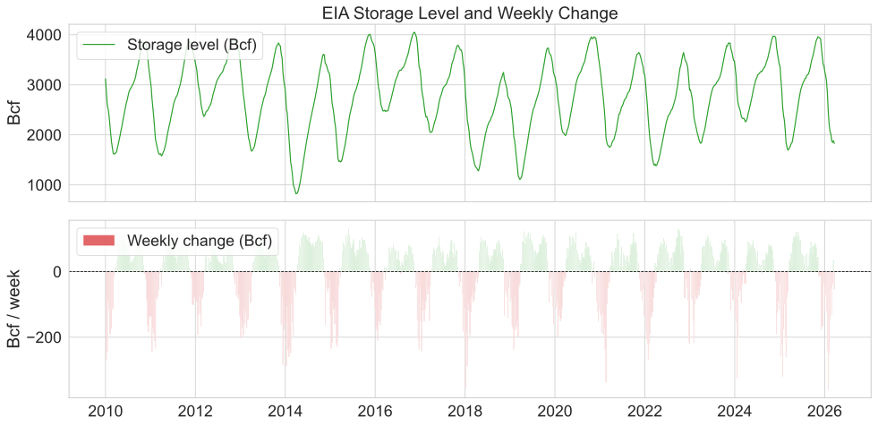

- Seasonal profile:

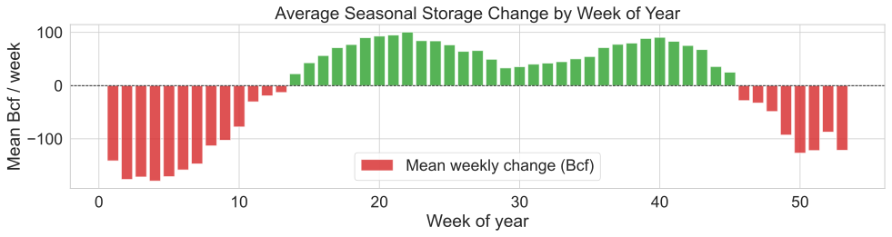

- Surplus/deficit:

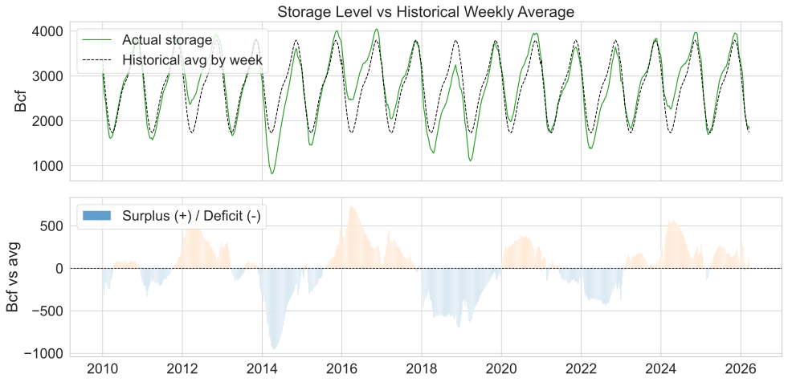

## 004 - Consumption (Demand Shape)

### Key learning
- US gas demand has a two-peak seasonal structure: winter heating and summer cooling/power burn.
- Demand is weather-sensitive in winter and increasingly power-burn-sensitive in summer.
- Model implication: preserve seasonality and include weather transforms (HDD/CDD) rather than raw temperature only.

### Diagrams
- Full history:

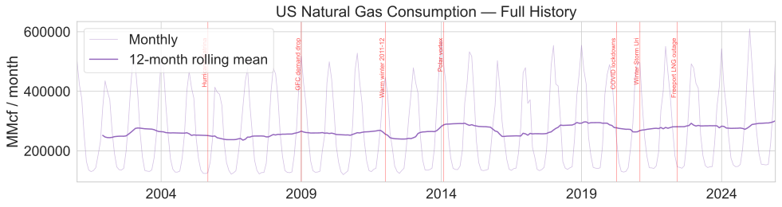

- Seasonal profile:

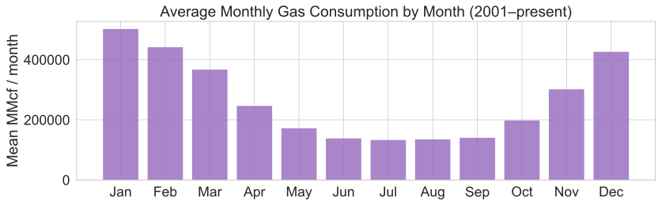

- YoY growth:

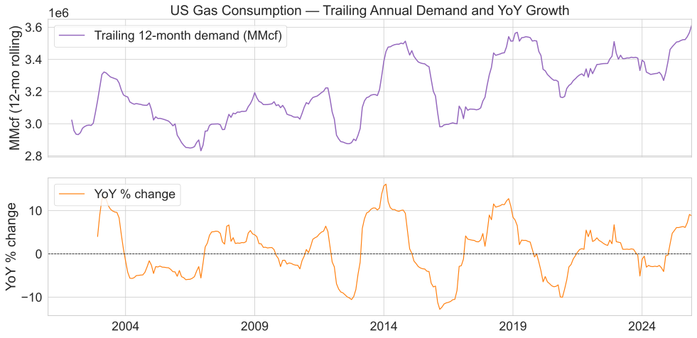

## 005 - Temperature / HDD / CDD (Primary Demand Regressors)

### Key learning
- Temperature is the dominant short-term demand driver.
- HDD/CDD transforms are superior to raw temperature because demand response is thresholded around 65F.
- Practical feature design:
  - HDD and CDD as core regressors.
  - Lagged HDD terms (for thermal inertia effects).
  - Aggregated HDD/CDD (weekly/monthly) to match forecasting horizon.

### Diagrams
- Temperature history:

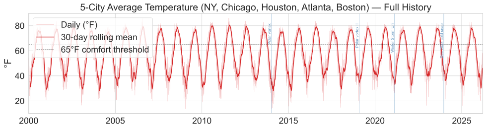

- HDD/CDD full history:

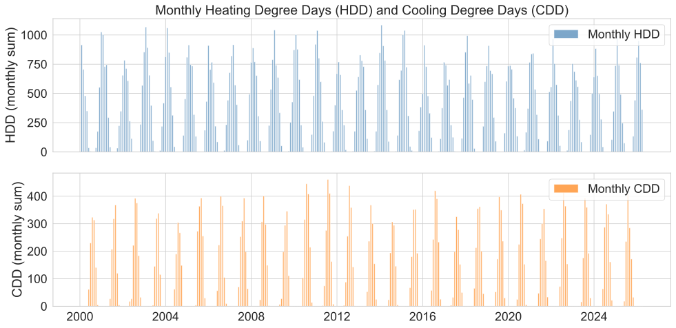

- HDD/CDD seasonal profile:

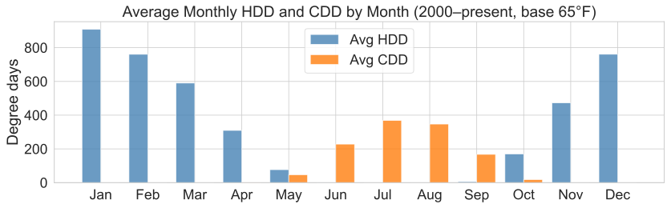

- Annual variability:

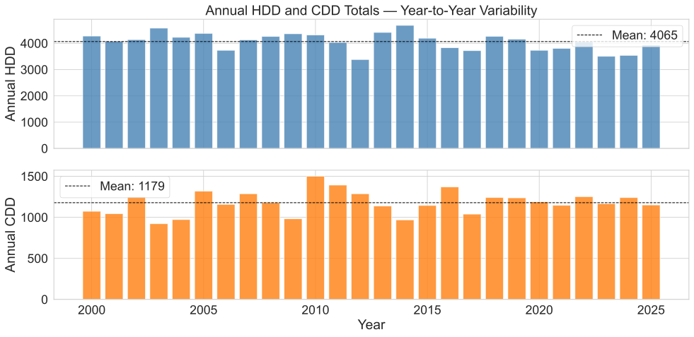

##  Feature Priority for the Model

1. Primary: HDD, CDD (plus short lags)
2. Secondary: storage surplus/deficit vs seasonal norm
3. Tertiary: lagged WTI (supply-side pressure)
4. Context: month/season flags and volatility/regime controls
